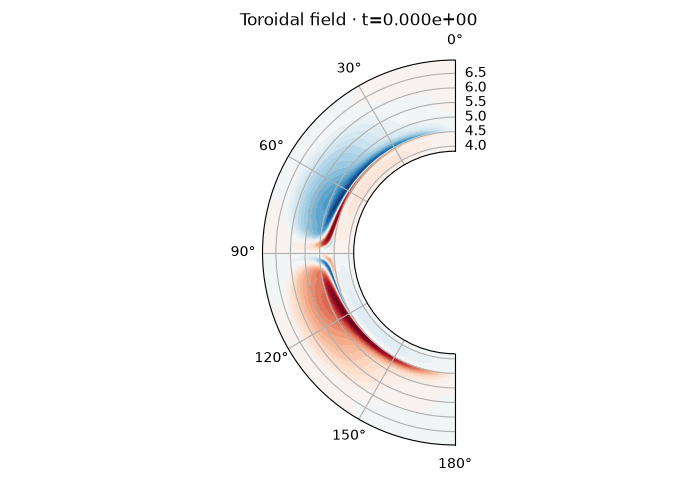
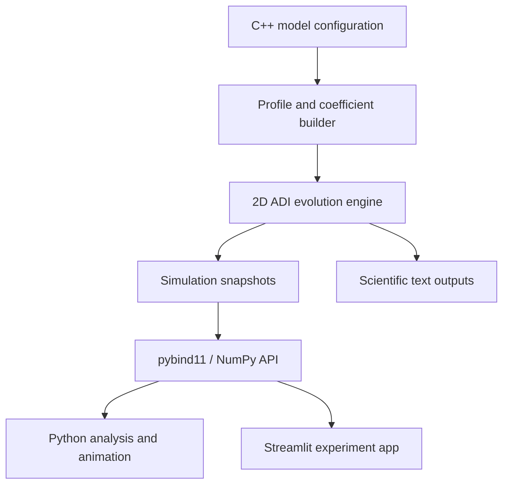

# Soladyne

## A C++ simulation suite for 2D solar dynamo evolution and tachocline confinement

Soladyne is an solar-dynamo MHD simulation package for simulating the
coupled evolution of magnetic fields and differential rotation inside an axisymmetric
solar convection-zone shell. The legacy code is based on Surya fortran code developed in IIA, Bangalore.
This package includes numerical calculations of angular-momentum transport, meridional circulation, and 
spatially varying diffusivity and explores how it influence the confinement and evolution of the solar tachocline.

The numerical solver is implemented in **C++17**. A **pybind11** interface exposes the
simulation state as NumPy arrays, while a **Streamlit** application provides interactive
parameter experiments and evolving field visualizations.



## Project highlights

- Coupled 2D evolution of poloidal field, toroidal field, and angular velocity.
- Axisymmetric spherical-shell domain covering `0.55 ≤ r/R☉ ≤ 1.0`.
- Separate radial profiles and angular grids for primary and midpoint quantities.
- Differential rotation, α-effect, meridional circulation, magnetic diffusion,
  turbulent viscosity, Lambda-effect transport, and Lorentz-force feedback.
- Alternating-direction implicit time integration with tridiagonal matrix solves.
- Potential-field upper boundary constructed using associated Legendre functions.
- C++ simulation lifecycle exposed directly to Python through pybind11.
- NumPy snapshots, compressed experiment exports, polar plots, and GIF animations.
- Interactive Streamlit controls for physical parameters and simulation duration.
- Native C++ tests, Python integration tests, Docker packaging, and GitHub Actions CI.

## Scientific objective

The solar tachocline is the thin transition region separating the differentially
rotating convection zone from the more uniformly rotating radiative interior. Because
strong radial shear can spread through viscous transport, a confinement mechanism is
required to maintain a thin tachocline.

TachoDynamo provides a controlled numerical environment for investigating whether the
interaction between large-scale magnetic fields and rotational shear can limit that
spreading. The simulation follows three coupled fields:

| State | Symbol | Role |
|---|---:|---|
| Poloidal potential | `A(r,θ,t)` | Represents the meridional magnetic-field component |
| Toroidal field | `Bφ(r,θ,t)` | Generated by rotational shear and transported through the shell |
| Angular velocity | `Ω(r,θ,t)` | Evolves through circulation, turbulent stresses, viscosity, and magnetic torque |

The model can be used to examine:

- radial penetration of differential rotation;
- magnetic coupling between the convection zone and deeper layers;
- sensitivity of tachocline thickness to magnetic-field strength;
- angular-momentum redistribution by meridional circulation;
- torsional variations produced by Lorentz-force feedback;
- the effect of turbulent diffusivity and viscosity transitions;
- hemispheric symmetry and magnetic-field migration.

## Model overview

The magnetic field is represented as

$$
\mathbf{B}=\nabla\times\left(A\,\hat{\boldsymbol\phi}\right)
+B_\phi\hat{\boldsymbol\phi}.
$$

The solver advances an axisymmetric mean-field dynamo system with the schematic form

$$
\frac{\partial A}{\partial t}
=\mathcal{D}_A(A)-\mathcal{A}_A(A)+\alpha B_\phi,
$$

$$
\frac{\partial B_\phi}{\partial t}
=\mathcal{D}_B(B_\phi)-\mathcal{A}_B(B_\phi)
+r\sin\theta\left(\mathbf{B}_p\cdot\nabla\right)\Omega,
$$

$$
\frac{\partial\Omega}{\partial t}
=\mathcal{T}_{\mathrm{visc}}
+\mathcal{T}_{\Lambda}
+\mathcal{T}_{\mathrm{circ}}
+\mathcal{T}_{\mathrm{Lorentz}}.
$$

Here, `𝒟` denotes turbulent diffusion, `𝒜` represents transport by meridional
circulation, and the final equation combines viscous transport, nondiffusive turbulent
stresses, circulation, and magnetic feedback.

### Radial profiles

Smooth error-function transitions define the principal regions of the model:

- a diffusivity transition near `r ≈ 0.70 R☉`;
- a toroidal-field diffusivity transition near `r ≈ 0.725 R☉`;
- enhanced near-surface diffusion above `r ≈ 0.975 R☉`;
- a surface-localized α-effect above approximately `0.95 R☉`;
- a turbulent-transport transition near `r ≈ 0.73 R☉`.

These profiles make it possible to study how transport across the convection-zone base
affects rotational shear and magnetic confinement.

## Software architecture



The C++ `Model` class owns all numerical state. Internal arrays use explicit grid
indexing so midpoint stencils, boundary locations, and radial/angular sweeps remain
auditable. Python receives independent contiguous arrays with shape `(257, 257)`.

## Repository structure

```text
soladyne/
├── cpp/
│   ├── include/solar_dynamo/model.hpp   # Public C++ simulation interface
│   └── src/
│       ├── model.cpp                    # Profiles, coefficients and time evolution
│       └── bindings.cpp                 # pybind11 NumPy bindings
├── python/solar_dynamo/
│   ├── simulation.py                    # Experiment orchestration and NPZ storage
│   ├── visualization.py                 # Polar plots and GIF animations
│   └── cli.py                           # Command-line runner
├── tests/
│   ├── cpp/                             # Native solver tests
│   └── python/                          # Binding, I/O, plot and app tests
├── scripts/validate_simulation_data.py  # Input/output structure validator
├── docs/numerical-method.md             # Numerical implementation notes
├── app.py                               # Streamlit application
├── CMakeLists.txt                       # C++ and pybind11 build configuration
├── pyproject.toml                       # Python package configuration
├── Dockerfile                           # Containerized Streamlit deployment
└── .github/workflows/ci.yml             # Multi-platform continuous integration
```

## Installation

### Requirements

- Python 3.10 or newer
- CMake 3.18 or newer
- A C++17 compiler
- pip

On Ubuntu or Debian:

```bash
sudo apt-get update
sudo apt-get install build-essential cmake
```

On macOS:

```bash
xcode-select --install
brew install cmake
```

On Windows, install Visual Studio Build Tools with the **Desktop development with
C++** workload and ensure CMake is available from PowerShell.

### Create the environment

```bash
git clone https://github.com/KishanDeka/soladyne.git
cd solar-dynamo-cpp

python -m venv .venv
source .venv/bin/activate
python -m pip install --upgrade pip
pip install -e ".[app,test]"
```

Windows activation:

```powershell
.venv\Scripts\Activate.ps1
```

The installation compiles the C++ core and places the pybind11 extension inside the
Python package.

## Running a simulation

### Command line

Run a short experiment from an initialization file:

```bash
solar-dynamo \
  --init data/init.dat \
  --steps 1000 \
  --output-dir output
```

Run until the configured maximum time:

```bash
solar-dynamo --init data/init.dat --tmax 10.0 --output-dir output
```

The default configuration uses `dt = 0.00005`. A complete `tmax = 10` experiment
therefore contains 200,000 time steps and should be treated as a production run rather
than an interactive preview.

### Python API

```python
from solar_dynamo import Model, Parameters

parameters = Parameters()
parameters.v0 = -20.0
parameters.et0 = 3.0
parameters.et1 = 0.04
parameters.al0 = 30.0
parameters.dt = 0.00005

model = Model(parameters)
model.initialize("data/init.dat")

model.step(200)
snapshot = model.snapshot()

print(snapshot.time)
print(snapshot.poloidal.shape)
print(snapshot.toroidal.shape)
print(snapshot.omega.shape)
```

Available snapshot arrays:

```python
snapshot.radius
snapshot.theta
snapshot.poloidal_u
snapshot.poloidal
snapshot.toroidal
snapshot.omega
```

### Simulation with periodic output

```python
model.step_with_output(2000, "output")
model.write_final_outputs("output")
```

Use `step()` for in-memory experiments and `step_with_output()` when periodic scientific
outputs are required.

## Input and output data

The initialization file contains four whitespace-separated columns:

```text
theta  radius  poloidal_quantity  toroidal_field
```

It must contain `257 × 257 = 66,049` rows in radial-major order.

Generated outputs include:

| File | Contents |
|---|---|
| `omg_lat.dat` | Angular velocity versus colatitude at a selected radius and multiple times |
| `diffrot.dat` | Two-dimensional differential-rotation snapshots |
| `final.dat` | Final angular velocity, poloidal quantity, and toroidal field |
| `.npz` export | Compressed arrays for Python analysis and reproducible plotting |

Validate data files with:

```bash
python scripts/validate_simulation_data.py \
  --init data/init.dat \
  --diffrot output/diffrot.dat \
  --omg-lat output/omg_lat.dat
```

## Visualization and animation

Python utilities provide polar-shell plots for:

- toroidal magnetic field;
- poloidal magnetic potential;
- angular velocity.

```python
from solar_dynamo import Parameters
from solar_dynamo.simulation import run
from solar_dynamo.visualization import make_figure, save_animation

result = run(
    Parameters(),
    init_file="data/init.dat",
    frames=40,
    steps_per_frame=20,
)

figure = make_figure(result, frame=-1, field="Toroidal field")
figure.savefig("toroidal_field.png", dpi=200)

save_animation(
    result,
    "dynamo_evolution.gif",
    field="Toroidal field",
    fps=12,
)
```

## Streamlit application

Launch the interactive interface with:

```bash
streamlit run app.py
```

The application supports:

- initialization-file upload;
- controls for meridional-flow amplitude, diffusivities, and α-effect strength;
- selection of the displayed physical field;
- configurable frame and step counts;
- magnetic-energy monitoring;
- time-frame navigation;
- downloadable compressed simulation snapshots.

The web interface uses the same compiled C++ model as the command-line and Python APIs.
It does not contain a separate reduced solver.

## Testing

Run the Python and integration tests:

```bash
pytest
```

Run the native C++ tests:

```bash
cmake -S . -B build \
  -DSOLAR_DYNAMO_BUILD_PYTHON=OFF \
  -DSOLAR_DYNAMO_BUILD_TESTS=ON

cmake --build build --parallel
ctest --test-dir build --output-on-failure
```

The test suite covers:

- grid dimensions and coordinate ranges;
- deterministic initialization;
- finite-valued state evolution;
- magnetic boundary conditions;
- timestep and iteration accounting;
- invalid or missing input handling;
- text-output shapes and column contracts;
- periodic output cadence;
- compressed NumPy serialization;
- polar-plot generation;
- Streamlit application startup;
- direct construction and evolution of the native C++ class.

GitHub Actions runs the Python suite on Linux, macOS, and Windows and performs a separate
native CMake build.

## Docker

```bash
docker build -t soladyne .
docker run --rm -p 8501:8501 soladyne
```

Open `http://localhost:8501` in a browser.

## Deploying the app

1. Push the repository to GitHub.
2. Confirm that the GitHub Actions workflow passes.
3. Sign in to [Streamlit Community Cloud](https://share.streamlit.io).
4. Select the repository and use `app.py` as the entry point.
5. Add the deployed URL to the GitHub repository description.

GitHub stores the source code and runs CI. The live Python application should be hosted
with Streamlit Community Cloud or another container-compatible service.

## Numerical considerations

- The fixed grid ensures that radial/angular stencils and boundary operators remain
  consistent across experiments.
- ADI splitting reduces the cost of each implicit two-dimensional update to sequences
  of one-dimensional tridiagonal solves.
- Radial and angular sweeps are applied in two half steps.
- The potential-field surface boundary is reconstructed from associated Legendre modes.
- Magnetic feedback is evaluated during both halves of the angular-velocity update.
- Simulation state is stored in contiguous C++ arrays and copied into conventional NumPy
  matrices only when a snapshot is requested.
- The Python global interpreter lock is released during expensive C++ initialization and
  stepping operations.

## Scope and limitations

Soladyne is a solar MHD simulation package. The output results depend on the chosen
transport coefficients, initial conditions, boundary assumptions, and dimensional
scalings. Before using it for real observational inferences, compare multiple radial and 
temporal resolutions, and validate tachocline-thickness and
cycle-period measurements against suitable reference calculations or observations.

## Roadmap

- Automated tachocline-thickness measurement from radial Ω gradients.
- Time-latitude butterfly diagrams at selectable radii.
- Magnetic and rotational energy-budget diagnostics.
- HDF5 checkpoint and restart support alongside the text interface.
- OpenMP parallelization of independent grid sweeps.
- Parameter-scan workflows for confinement regimes.
- Quantitative cycle-period and parity detection.
- Reproducible benchmark datasets and performance reports.

## License

This project is available under the MIT License. See [LICENSE](LICENSE).
